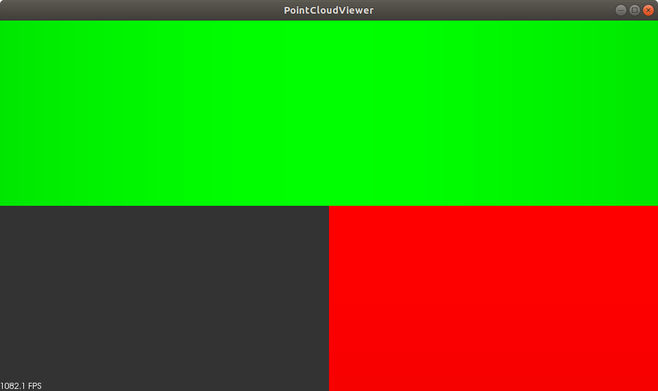

```shell
user@pc%
mkdir build && cd build
user@pc%
PKG_CONFIG_PATH=/home/pollenjp/.flann/install/flann-1.8.5/lib/pkgconfig:/home/pollenjp/.eigen/install/eigen-3.3.7/share/pkgconfig \
    /home/pollenjp/.cmake/download/cmake-3.13.4-Linux-x86_64/bin/cmake \
    -D CMAKE_BUILD_TYPE=Debug \
    -D CMAKE_PREFIX_PATH="/home/pollenjp/.vtk/install/vtk-8.2.0/shared/lib/cmake;/home/pollenjp/.pcl/install/pcl-1.9.1/shared/share/pcl-1.9" \
    -D BOOST_ROOT=/home/pollenjp/.boost/install/boost-1.70.0/shared \
    ..
user@pc%
make
user@pc%
LD_LIBRARY_PATH="${HOME}/.vtk/install/vtk-8.2.0/shared/lib:${LD_LIBRARY_PATH}" \
    ./sample_visualization
```

結果

